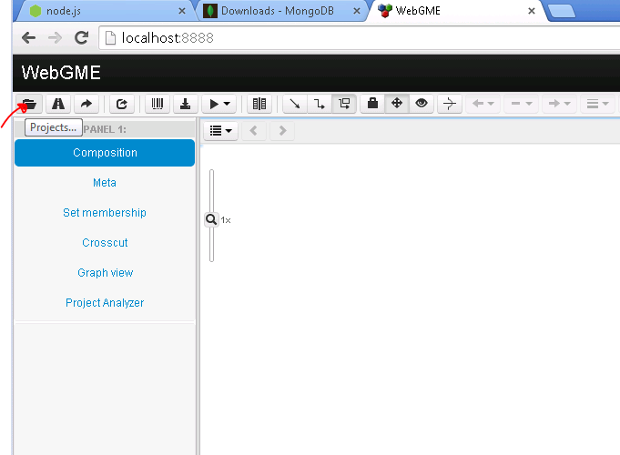
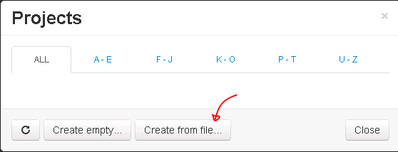
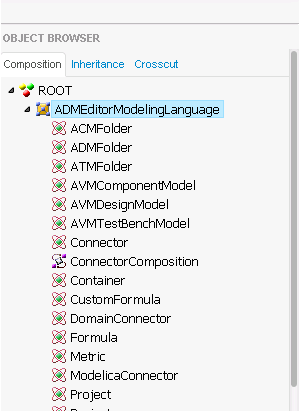
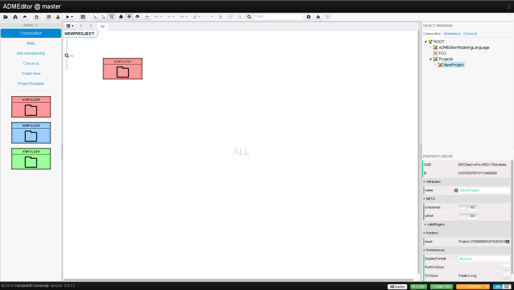
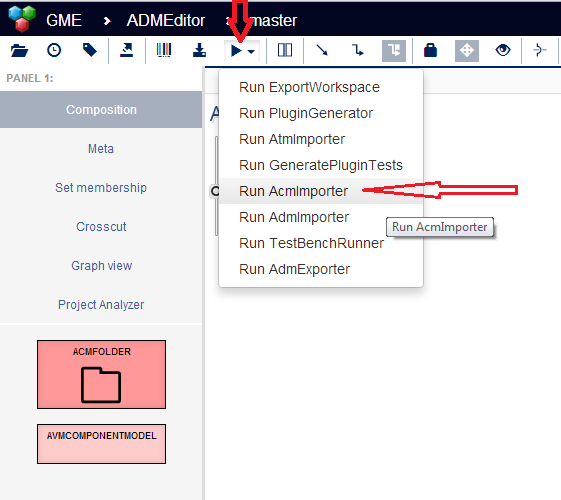
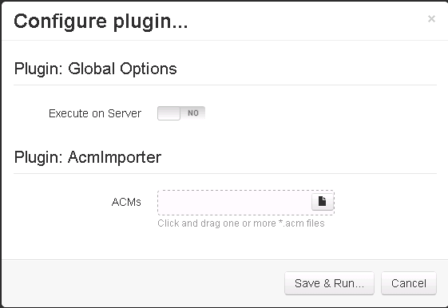
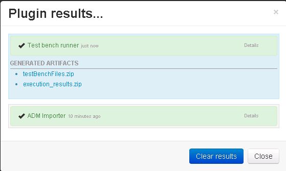
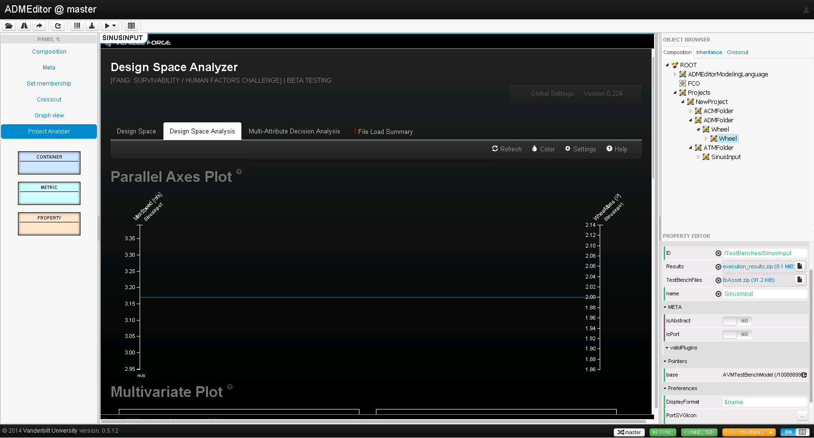

% CyPhy-WebGME manual
% Dynamics Team
% May 29, 2014

# Installing and Serving Application #
## Dependencies ##
### NodeJS ###
Download nodejs from http://nodejs.org/download/. If you have 64-bit version of windows select the 64-bit version. During installation make sure that all options are selected. (The provided batch-files assumes that node and npm are avaliable.)

### MongoDB ###
Download mongodb from http://www.mongodb.org/downloads. If you have 64-bit version of windows select the 64-bit version. The provided batch-files assumes it is installed at `C:\Program Files\MongoDB 2.6 Standard`. (Choosing typical installation and on the 64-bit version will put it there.)

## Installation ##
Make any necessary modifications to `install_script.cmd` and run it. It will log the progress in `install.log`.

## Serving a WebGME application ##
 - Start the data-base by running `launch_database.cmd`. 
 - Proceed with running `launch_app.cmd`.

While serving, leave both applications running and visit [localhost:8855](http://localhost:8855) in a browser.

# Starting a new ADMEditor Project #
From [localhost:8855](http://localhost:8855), click the folder icon in the left most corner of the tool-bar.

In the first dialog select `Create from file...`. Name the new project `ADMEditor` (case sensitive!) and click `Import file...`. and select `webgme-cyphy\meta\ADMEditor_metaOnly.json` which contains the META-model for the ADMEditor-Language.

The root-node (named ADMEditor) should show up and if you expand it and double-click on the ADMEditorModelingLanguage will show up on the canvas. This contains the object types which are available in this language.

# Working with an ADMEditor Project #

## Create a Workspace ##

Double-click on the ADMEditor (root) object to open it, and click and drag a Workspace object onto the canvas from the part browser on the left-hand side. Open the Workspace, create a new ACMFolder, ADMFolder and ATMFolder using the same click and drag method.

## Working with ACMs ##

Open the ACMFolder and click the play-button drop down menu in the tool-bar. This will display the plugins (interpreters) that exist for the ADMEditor project. Run the AcmImporter. 

Multi-select and drag and drop the ACM packages files from `\samples\RollingWheel\Components` as shown in the figure.

## Working with ADMs ##
Open the ADMFolder and run the AdmImporter. Either drag and drop or browse for the `\samples\RollingWheel\Wheel.adm` file and run the importer.

You now have a design that you can edit inside WebGME. As long as you preserve the interfaces in the top-level container you will be able to execute it from a test-bench. Apart from that, you can add new components, add/modify parameters, create subsystems etc.

## Working with ATMs ##
Create a new AVMTestBenchModel inside the folder. Open it up and set the `ID` to `/TestBenches/SinusInput` and choose a name. Drag and drop the `/samples/RollingWheel/tbAsset.zip` on the the attribute `TestBenchFiles`. Currently there is no support for editing test-benches inside WebGME. Instead you need to provide the test-bench as an xme together with the related files (e.g., post-processing scripts). You can unzip `tbAsset.zip` manually to get an idea of how it looks.

Drag and drop the Wheel container from the project-tree onto the test-bench and select make copy (instances have limited support at the moment).

Go up a level in the model hierarchy. You will see the TestBench you created. Drag-n-drop the design onto the pointer icon of the TestBench.

Run the TestBenchRunner-plugin using the play button. As a first run, do not execute the test-bench. When it has finished you can look at the plugin-result and expand it. You should be provided with links to the generated artifacts. You can run the cmd-file on your machine, provided it has the META-tools installed.

Now run the plugin again and this time choose "Run Test-bench". This will take up to a couple of minutes. Once the the plugin has finished you can select thh `Project Analyzer` view in the Panel to the left. 

